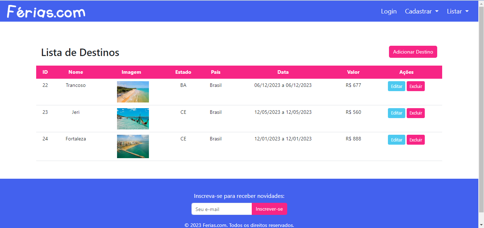
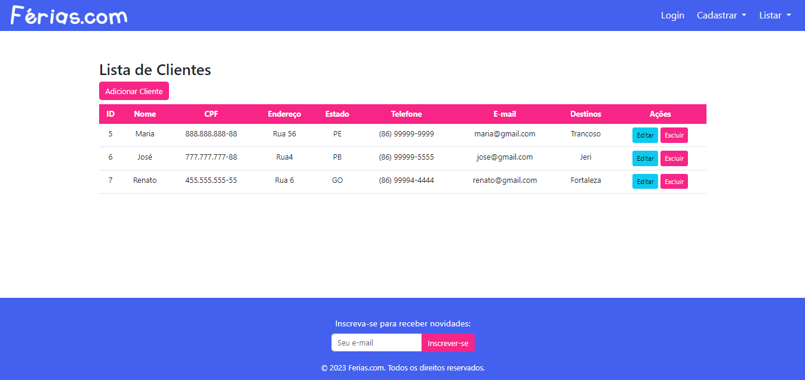
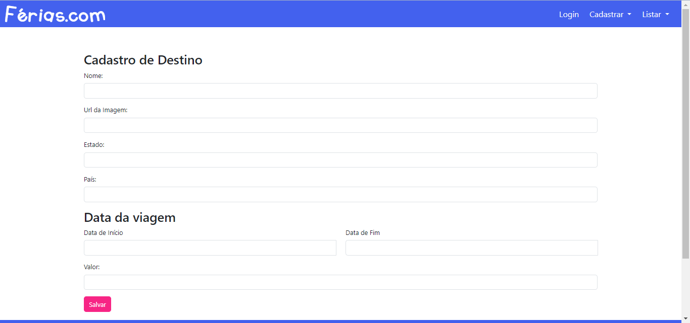
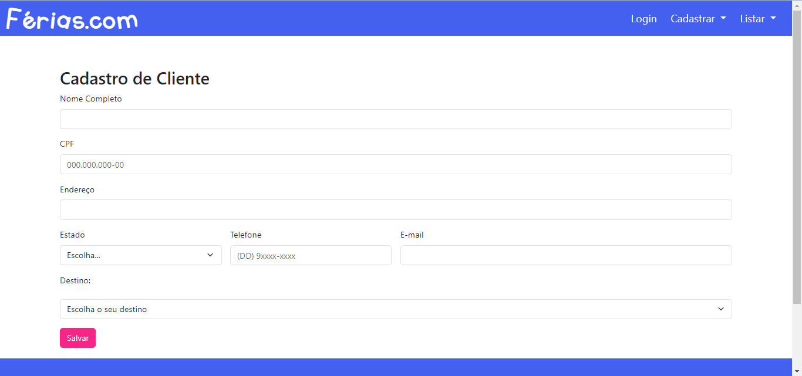
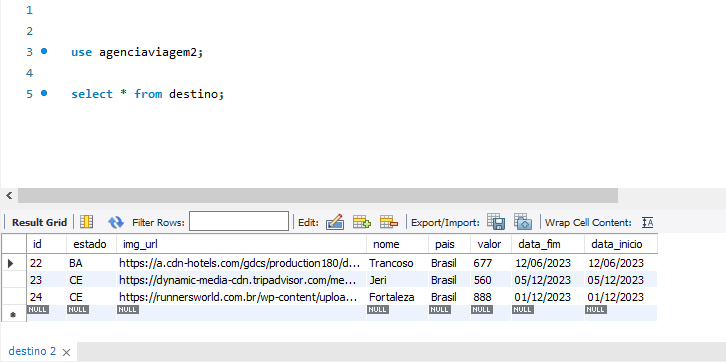

# Atividade-Pr-tica-do-M-dulo-5
## Sobre o projeto

Uma aplicação WEB Agência de Viagens usando o Ecossistema Spring framework, com Front-end usando MVC ou ReactJS - Back-end com Java Spring Boot, Spring MVC, Persistência de Dados com Spring Data JPA. 

O projeto foi construído no curso de Desenvolvedor Full Stack da Recode Pro, como requisito para obter a nota final do Módulo 5.

## Layout web

## Banco de dados

# Tecnologias utilizadas
## Back end
- Java Spring Boot
- Spring MVC

## Front end
- Thymeleaf

## Implantação em produção
- Back end e Front end: STS
- Banco de dados: MySQL
